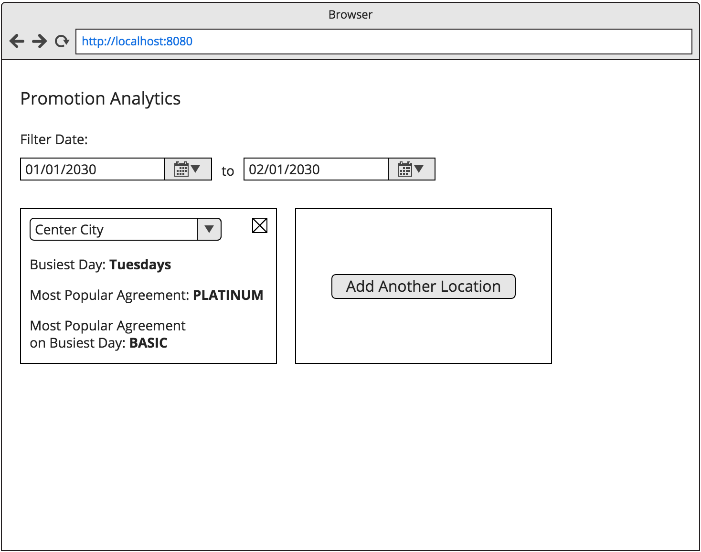

# Front-end Code Challenge - 2018

In this code challenge, you'll demonstrate your programming abilities by building a data-driven, component-based application. We expect the challenge to take you about four hours.

### Getting Started

Clone, bootstrap and start the project:

```
$ git clone git@github.com:TechniqueSoftware/frontend-challenge.git
$ # cd into desired project
$ npm install
$ npm start
```

An app should now be running on your machine. JSX, babel and hot-reloading have been included.

### Instructions

The product team would like you to create a dashboard for health clubs and studios. The dashboard will help them determine when they should run promotions for membership agreements. The success of a promotion relies on the day of the promotion and the popularity of a membership agreement. Conveniently, we already have a few endpoints that provides this information for one of our clients.

* `GET api/locations`
* `GET api/locations/{locationId}/member-checkins`
* `GET api/locations/{locationId}/member-agreements`

Implement the following features. Your app should look nice and feature accessibility, but functionality is the first priority. Use the wireframe below as a guide.



1. Many widgets can be added to the dashboard. Each widget contains:
    * A select input for selecting a location
    * A stat of the busiest weekday (Monday, Tuesday, etc.) for the selected location
    * A stat of the most popular agreement for the selected location
    * A stat of the most popular agreement on the busiest weekday for the selected location
1. Widgets can be removed from the dashboard
1. A date range input allows users to filter the data to use for statistics for any given time period

Our engineering team uses testing to prevent bugs and fuel a culture of confidence and trust. There are many things that can be tested, but we'd like you to focus on the following.

1. Test statistic logic
1. Test major components
1. Tests should be runnable by

```
$ npm test
```

Lastly, the engineering team will need your evaluation on how the feature will scale over time. Take notes on scaling issues or edge cases the feature might run into over its lifetime, and send your notes with you code challenge. A few bullet points will do.

### Questions

We can't guarantee equal availability for all candidates during the code challenge. To be fair, no questions will be answered. If you have a question, please send it with your submission.

### Helpful Resources

Here are some resources we'd use to complete the code challenge. Feel free to use others!

* [Jest](https://jestjs.io/): Testing platform
* [Enzyme](http://airbnb.io/enzyme/): React testing utility
* [Moment.js](https://momentjs.com/): Parse and display time
* [Tachyons](http://tachyons.io/) or [Bootstrap](https://getbootstrap.com/): Layout and design
* [React’s notes on accessibility](https://reactjs.org/docs/accessibility.html)
* [Google's notes on accessibility](https://developers.google.com/web/fundamentals/accessibility/)

### Submission

When you've completed the code challenge, zip the project and attach it in a response to the code challenge email. Include your evaluation notes, and if you'd like, tell us about your code or how you think the challenge went!

### Evaluation

What are we looking for in your code? We'll be evaluating submissions in this order:

* Functional application
* Clear, well written and structured code
* Passing tests
* Sensible design with accessibility features
* Amount of criteria met
